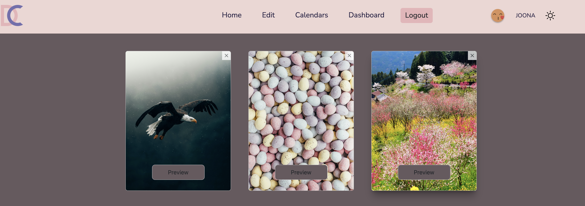

# Dream Calendar

## Description
In this app you can design your own online advent calendar. Users can choose a calendar theme, start and end dates, style the hatches. Users can also have their own collection of calendars and share their favourite ones with others. To be able to edit and save calendars, users have to be registered. It is also possible to choose the dark mode of the app. There is an admin account that allows to view a dashboard with users data, messages and the amount of shared calendars, users and messages.

## Technologies were used

- React.js (Vite)
- React Redux Toolkit
- React Router DOM
- Firebase
- Unsplash api to choose the theme and hatches of calendars 
- Tailwind CSS
- Bootstrap

### Check the App on Firebase hosting

### To run this app on your computer you need

- clone the repository on GitHub: https://github.com/JoonAro/calendarMaker.git
- get unsplash and firebase API key 
- npm install
- npm run dev

### Visual

